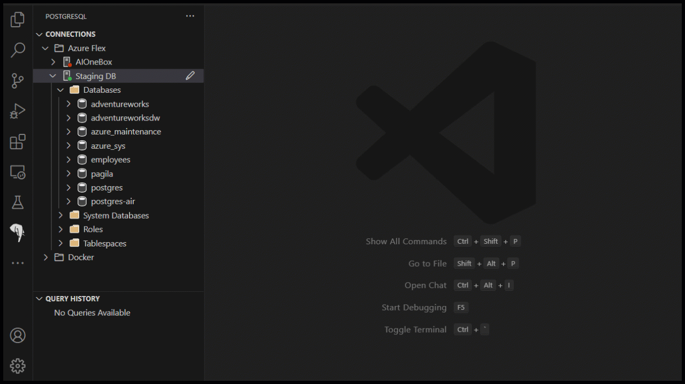

# PostgreSQL for Visual Studio Code (Preview)

PostgreSQL for Visual Studio Code is the essential extension for working with PostgreSQL databases - locally or in the cloud. Connect, query, build, and chat with your databases with ease, including seamless Entra authentication for Azure Database for PostgreSQL.

To learn more about the PostgreSQL extension and how it can simplify building
applications on PostgreSQL, visit our official [MSFT Learn Documentation].

## Features

Below are some of the key features of the PostgreSQL extension:

### Connect to PostgreSQL

Connect to any PostgreSQL database.

Browse Azure to easily find and connect to your Azure Database for PostgreSQL servers with either password or Entra authentication.

### Schema Visualization

Visualize your database schema quickly in VS Code.

### Copilot @pgsql agent

Chat with your database using the @pgsql agent in Copilot 'Ask' mode. Requires GitHub Copilot.

### Agent Mode Tools

Supercharge your workflow with GitHub Copilot Agent Mode tools, which allows the agents to run SQL queries, create tables, design schemas, import CSV files, and more.

### Create a docker PostgreSQL

Create a PostgreSQL database in a Docker container easily with a few clicks.

### Query

Run queries in a connected, intellisense-enabled VS Code editor. Results are displayed in a grid view, and you can easily export the results to CSV, JSON, or Excel.

### Run psql

Quickly connect psql to any of your databases, including Azure Database for PostgreSQL with Entra authentication.

## Usage and feedback

For details on how to receive support for this extension, please see the
[SUPPORT.md](SUPPORT.md) document.

When reporting issues, it may be helpful to include debug logs. You can view
extension logs for the current session by:

1. Opening the Command Palette (Ctrl+Shift+P or Cmd+Shift+P on macOS).
2. Typing `PGSQL: Show Extension Logs` and selecting the option.
3. The logs will be displayed in the Output panel. You can copy and paste the logs from there.

The Tools Service also outputs logs to disk, which can be accessed by running
this command in the Command Palette:

- `PGSQL: Show Tools Service Logs`.

In rarer cases, the logs may be found in the VS Code logging directory, per
session. To open the session log folder, run this command in the Command
Palette:

- `Developer: Open Logs Folder`.

Look for log files whose name contains the terms:

- `Microsoft PostgreSQL Tools Service`
- `Microsoft PostgreSQL`

All of these logs could include host names, user names and other data that may be
sensitive. Please review their contents before sharing these logs with others, or
attaching them to an issue.

## Supported Operating Systems

The extension is supported on recent Windows, macOS, and Linux distributions. Experimental
support for ARM64 is available on Linux and macOS.

## Telemetry

This extension collects telemetry data, which is used to help understand how to
improve the product. For example, this usage data helps to debug issues, such as
slow start-up times, and to prioritize new features. You can disable telemetry
as described in the VS Code [disable telemetry reporting] documentation.

Please see [PRIVACY](PRIVACY) for more information about data collection and use.

## Security reporting

Please see [SECURITY.md](SECURITY.md) for information on how to report security vulnerabilities.

## Code of Conduct

Please see [CODE_OF_CONDUCT.md](CODE_OF_CONDUCT.md) for information on our code of conduct.

## Contributing

This project welcomes contributions and suggestions.  Most contributions require you to agree to a
Contributor License Agreement (CLA) declaring that you have the right to, and actually do, grant us
the rights to use your contribution. For details, visit https://cla.opensource.microsoft.com.

When you submit a pull request, a CLA bot will automatically determine whether you need to provide
a CLA and decorate the PR appropriately (e.g., status check, comment). Simply follow the instructions
provided by the bot. You will only need to do this once across all repos using our CLA.

This project has adopted the [Microsoft Open Source Code of Conduct](https://opensource.microsoft.com/codeofconduct/).
For more information see the [Code of Conduct FAQ](https://opensource.microsoft.com/codeofconduct/faq/) or
contact [opencode@microsoft.com](mailto:opencode@microsoft.com) with any additional questions or comments.

## Trademarks

This project may contain trademarks or logos for projects, products, or services. Authorized use of Microsoft
trademarks or logos is subject to and must follow
[Microsoft's Trademark & Brand Guidelines](https://www.microsoft.com/en-us/legal/intellectualproperty/trademarks/usage/general).
Use of Microsoft trademarks or logos in modified versions of this project must not cause confusion or imply Microsoft sponsorship.
Any use of third-party trademarks or logos are subject to those third-party's policies.

## Third-party licenses

This project may contain third-party libraries. The licenses for these libraries
are located in [Third-party notices (extension)] and [Third-party notices (tools)].

[disable telemetry reporting]: https://code.visualstudio.com/docs/getstarted/telemetry#_disable-telemetry-reporting
[MSFT Learn Documentation]: https://aka.ms/pg-vscode-docs
[Third-party notices (extension)]: ThirdPartyNotices-EXTENSION.txt
[Third-party notices (tools)]: ThirdPartyNotices-TOOLS.txt
