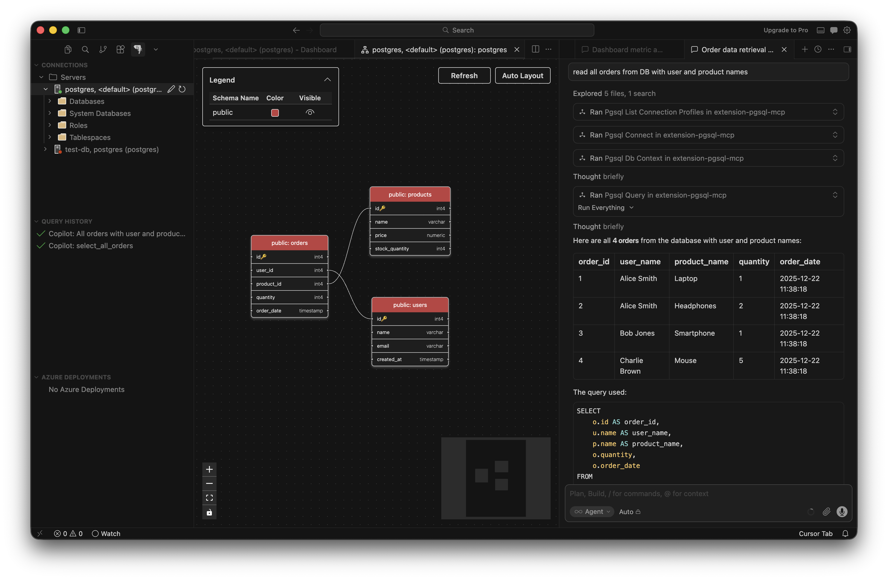

# PostgreSQL for Cursor

PostgreSQL for Cursor is the essential extension for working with PostgreSQL databases - locally or in the cloud. Connect, query, build, and chat with your databases with ease, including seamless Entra authentication for Azure Database for PostgreSQL. The extension integrates directly with Cursor's built-in AI so you can explore schemas, write queries, and automate database workflows without leaving the editor.

To learn more about the PostgreSQL extension and how it can simplify building
applications on PostgreSQL, visit our official [MSFT Learn Documentation].

## Supported Operating Systems

The extension is supported on the following operating systems:

- **Windows**: x64 and ARM64 (ARM64 requires Windows 11)
- **Linux**: x64 and ARM64 (requires glibc 2.35+)
- **macOS**: macOS 13+

## IDE Compatibility

This release is published for and officially supported on Cursor. Other VS Code forks can install and use it as well, although feature availability depends on the APIs provided by each IDE.

- **MCP server integration:** The IDE must provide an MCP registration API for extensions. Cursor and Visual Studio Code provide this API. IDEs that do not, including Antigravity and Kiro, cannot use the MCP server. Other extension features, such as connections and queries, should continue to work.
- **code-server:** code-server uses Open VSX as its extension marketplace, so the extension appears with Cursor branding. This is expected. code-server is not officially supported, but the extension should work there.

## About This Repository

This repository does not contain the source code for the PostgreSQL extension, which is not [open source]. Instead, this repository serves as a hub for [issue tracking], documentation, and community feedback.

## Features

Below are some of the key features of the PostgreSQL extension:

### Connect to PostgreSQL

Connect to any PostgreSQL database.

Browse Azure to easily find and connect to your Azure Database for PostgreSQL servers with either password or Entra authentication.

### Explore your database

Easily explore your database objects, including tables, views, functions, and more.

### Schema Visualization

Visualize your database schemas quickly in Cursor.

### Query Plan Visualization

Explore PostgreSQL EXPLAIN output in four synchronized views: an interactive node graph showing operator relationships, an icicle chart for identifying hotspots, a sortable table for comparing nodes, and a raw source view with Monaco Editor support. Color-coded severity groups highlight performance bottlenecks, and Cursor AI integration provides AI-assisted analysis and optimization guidance via **Analyze with AI**. Launch the visualizer from the query editor toolbar, the Query Results panel, or the Command Palette.

### Object Explorer Search

Search for database objects by name across connections, databases, and schemas — without manually expanding the Object Explorer tree. Filter by object type (tables, views, functions, sequences, and more) and schema, then click any result to navigate directly to it in the tree. Launch search from the Object Explorer toolbar or by right-clicking any server, database, or schema node.

### Apache AGE Graph Visualization

Run Apache AGE Cypher queries and explore the results as an interactive node-edge graph. The extension automatically detects graph query results and renders them in a visual explorer with per-node callouts, zoom and pan controls, export support, and theme-aware styling.

### Cursor AI integration

Chat with your database using Cursor's built-in AI. Right-click a database in the Object Explorer and select **Connect AI** to start an Agent mode session with that database already in scope — no extra subscription or sign-in is required beyond Cursor itself.

### Agent Mode Tools

Supercharge your workflow with Cursor Agent Mode tools, which let the AI run SQL queries, create tables, design schemas, import CSV files, and more.

### MCP server (pgsql-mcp)

The extension automatically registers a Model Context Protocol (MCP) server in Cursor. Once the extension is active and AI features are enabled (`pgsql.copilot.enable` is `true`), Cursor's native chat and Agent mode can discover and call the PostgreSQL tool surface — list connection profiles, connect, inspect schema, run queries, analyze plans, visualize schemas, and more — without any manual MCP setup.

### Server Dashboard

Get insights into your PostgreSQL server performance with the Server Dashboard.

### Metrics Intelligence with Cursor AI

Get intelligent insights and help with performance and troubleshooting your PostgreSQL database with Cursor AI.

### Create an Azure Database for PostgreSQL

Create a new Azure Database for PostgreSQL Flexible Server or Azure HorizonDB cluster directly from Cursor with just a few clicks, without switching to the Azure Portal.

### Manage Azure Database for PostgreSQL servers

Manage your Azure Database for PostgreSQL servers, including starting, stopping, firewall rules, server parameters, and more. Restore or clone existing Flexible Server instances directly from the server dashboard.

### Create a docker PostgreSQL

Create a PostgreSQL database in a Docker container easily with a few clicks.

### Query

Run queries in a connected, IntelliSense-enabled query editor. Results are displayed in a grid view, and you can easily export the results to CSV, JSON, or Excel.

### Run psql

Quickly connect psql to any of your databases, including Azure Database for PostgreSQL with Entra authentication.

## Oracle to Azure Database for PostgreSQL Schema and Application Conversion (Preview)

The PostgreSQL extension now includes an intelligent schema conversion feature that helps you migrate Oracle database schemas to Azure Database for PostgreSQL. This AI-powered tool automatically converts Oracle schema objects—including tables, views, stored procedures, functions, and triggers—into PostgreSQL-compatible equivalents. The conversion process uses Azure OpenAI to understand complex Oracle constructs and transform them following PostgreSQL best practices, while validating all converted objects in a scratch database environment to ensure compatibility before deployment. When automatic conversion isn't possible for complex Oracle-specific features, the tool flags these items as Review Tasks that you can resolve with assistance from Cursor's AI agents.

The Application Conversion feature complements schema migration by automatically transforming your Oracle client application code to work with Azure Database for PostgreSQL. Simply import your source application code into the migration workspace and start the automated conversion process, which generates a comprehensive migration report detailing all required changes. The tool provides built-in diff tools to review and compare converted files side-by-side, making it easy to understand and validate the transformations. While you can perform application conversion independently, completing a schema migration first is strongly recommended—this enables the application conversion process to leverage schema context for more accurate and higher-quality code transformation results, ensuring your Oracle-dependent application logic, queries, and data access patterns are properly adapted for PostgreSQL.

## Usage

Get started with the PostgreSQL extension by installing it from the Open VSX Registry.

## Feedback

For details on how to receive support for this extension, please see the
[SUPPORT.md](SUPPORT.md) document.

When reporting issues, it may be helpful to include debug logs. You can view
extension logs for the current session by:

1. Opening the Command Palette (Ctrl+Shift+P or Cmd+Shift+P on macOS).
2. Typing `PGSQL: Show Extension Logs` and selecting the option.
3. The logs will be displayed in the Output panel. You can copy and paste the logs from there.

The Tools Service also outputs logs to disk, which can be accessed by running
this command in the Command Palette:

- `PGSQL: Show Tools Service Logs`.

In rarer cases, the logs may be found in Cursor's logging directory, per
session. To open the session log folder, run this command in the Command
Palette:

- `Developer: Open Logs Folder`.

Look for log files whose name contains the terms:

- `Microsoft PostgreSQL Tools Service`
- `Microsoft PostgreSQL`

All of these logs could include host names, user names and other data that may be
sensitive. Please review their contents before sharing these logs with others, or
attaching them to an issue.

## Telemetry

This extension collects telemetry data, which is used to help understand how to
improve the product. For example, this usage data helps to debug issues, such as
slow start-up times, and to prioritize new features. You can disable telemetry
through Cursor's telemetry settings; because Cursor is built on the VS Code
platform, the underlying [disable telemetry reporting] guidance applies.

Please see [PRIVACY](PRIVACY) for more information about data collection and use.

## Security reporting

Please see [SECURITY.md](SECURITY.md) for information on how to report security vulnerabilities.

## Code of Conduct

Please see [CODE_OF_CONDUCT.md](CODE_OF_CONDUCT.md) for information on our code of conduct.

## Contributing

This project welcomes contributions and suggestions.  Most contributions require you to agree to a
Contributor License Agreement (CLA) declaring that you have the right to, and actually do, grant us
the rights to use your contribution. For details, visit https://cla.opensource.microsoft.com.

When you submit a pull request, a CLA bot will automatically determine whether you need to provide
a CLA and decorate the PR appropriately (e.g., status check, comment). Simply follow the instructions
provided by the bot. You will only need to do this once across all repos using our CLA.

This project has adopted the [Microsoft Open Source Code of Conduct](https://opensource.microsoft.com/codeofconduct/).
For more information see the [Code of Conduct FAQ](https://opensource.microsoft.com/codeofconduct/faq/) or
contact [opencode@microsoft.com](mailto:opencode@microsoft.com) with any additional questions or comments.

## Trademarks

This project may contain trademarks or logos for projects, products, or services. Authorized use of Microsoft
trademarks or logos is subject to and must follow
[Microsoft's Trademark & Brand Guidelines](https://www.microsoft.com/en-us/legal/intellectualproperty/trademarks/usage/general).
Use of Microsoft trademarks or logos in modified versions of this project must not cause confusion or imply Microsoft sponsorship.
Any use of third-party trademarks or logos are subject to those third-party's policies.

## Third-party licenses

This project may contain third-party libraries. The licenses for these libraries
are located in [Third-party notices (extension)] and [Third-party notices (tools)].

[disable telemetry reporting]: https://code.visualstudio.com/docs/getstarted/telemetry#_disable-telemetry-reporting
[issue tracking]: https://github.com/microsoft/vscode-pgsql/issues
[MSFT Learn Documentation]: https://aka.ms/pg-vscode-docs
[open source]: https://github.com/microsoft/vscode-pgsql/issues/35
[Third-party notices (extension)]: ThirdPartyNotices-EXTENSION.txt
[Third-party notices (tools)]: ThirdPartyNotices-TOOLS.txt
